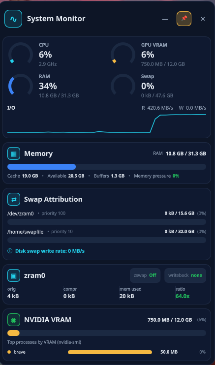

# System Monitor

A readable, free-floating desktop widget for KDE Plasma on Wayland, built with
[Quickshell](https://quickshell.outfoxxed.me/).

<p align="center">
  
</p>

## What it shows

- RAM used, available memory, cache and memory pressure
- zram compression, RAM held and savings
- Real disk swap usage and write rate, separated from zram activity
- Combined NVIDIA VRAM (one ring gauge) with a per-GPU bar, per-GPU die temp, and the heaviest VRAM consumer
- CPU, RAM, swap and VRAM summaries at a glance
- An expandable full-height storage sidecar with free space for mounted internal
  and removable devices, plus a per-device I/O sparkline; it refreshes automatically
  when media is added or removed
- An expandable AI spend sidecar (tab immediately right of storage) for Codex,
  OpenCode Go, Cursor, OpenRouter, DeepSeek, OpenAI and Meta

The main idea is simple: zram compaction happens in RAM, while disk swap is
actual storage I/O. They should never be presented as the same kind of pressure.

## Run

```bash
# Install, enable and start the user service
./scripts/install.sh --start

# Or run directly during development (live reload)
quickshell -p ./shell
```

To stop the service:

```bash
systemctl --user stop qs-system-monitor
```

Requires Quickshell 0.3+, Wayland (Hyprland or KDE Plasma) and Linux. zram is optional;
the widget degrades gracefully when it is unavailable. NVIDIA VRAM details use
`nvidia-smi` when available.

## Safety

The widget runs alongside Plasma as a normal user process. It only reads system
statistics from `/proc` and `/sys`, plus read-only `nvidia-smi` and `lsblk` queries,
and (for the AI spend tab) read-only billing APIs using credentials already on the
machine or an optional secrets file. It does not require root, change zram
configuration or replace any Plasma component.

## AI spend tab

The `$` tab to the right of Storage shows per-provider spend or quota. It does
**not** add those numbers together (plan %, remaining credits and period spend are
different units).

| Provider | What you see | Source |
| --- | --- | --- |
| Codex | 5-hour / weekly quota % | Local Codex CLI login (`~/.codex/auth.json`) |
| OpenCode Go | 5-hour / weekly / monthly quota % | `GET /zen/go/v1/usage` via OpenCode `auth.json` |
| Cursor | Cursor models % + Other models % (not list-price $) | Local Cursor login (undocumented dashboard API) |
| OpenRouter | Remaining credits (+ this-month usage) | Official `GET /api/v1/credits` |
| DeepSeek | Remaining credits (granted + topped-up split, live peak/off-peak rate flag) | Official `GET /user/balance` — needs `deepseekKey` |
| OpenAI | Month-to-date USD | Official costs API — needs an **admin** key |
| Meta AI | n/a | No account-wide billing API |

OpenAI (and an override for any other key) goes in:

```
~/.config/qs-system-monitor/ai-spend.json
```

Copy `packaging/ai-spend.example.json` and fill `openaiAdminKey` or `deepseekKey`. Never commit that
file. The collector also honors `OPENAI_ADMIN_KEY` / `OPENROUTER_API_KEY` / `DEEPSEEK_API_KEY` when the
widget is launched from a login shell; the systemd user service typically does not
inherit those, so the secrets file or local app stores are the reliable path.

## Documentation

- [PLAN.md](./PLAN.md) — architecture, formulas and implementation milestones
- [AGENTS.md](./AGENTS.md) — contributor and safety rules

## License

TBD
